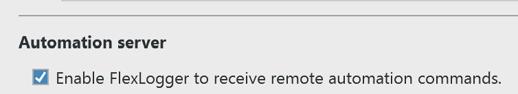

.. _getting_started:

Getting Started
===============

Learn the basic concepts required to automate FlexLogger tests using the Python API.

Prerequisites
-------------

Before using the FlexLogger Python API, complete the following tasks.
  * Install FlexLogger 2021 R3 or later and create a FlexLogger project with one or more input channels.
  * Enable the Automation server preference in FlexLogger. In FlexLogger, navigate to **File>>Preferences** and check **Enable FlexLogger to receive remote automation commands** in the Automation server section of the General tab.
  * Download and install Python 3.6 or later from python.org/downloads. For more information on installing and using Python, refer to the Python documentation on docs.python.org. During installation, enable **Add Python to PATH** so you can execute Python commands more easily.
  * Install the FlexLogger Automation Python module, ``niflexlogger-automation``, using the method described below or one of the methods described in the `Readme <installation_section>`_.

If you are new to Python, start by `creating and running your first script <create_run_script>`_. If you an experienced Python user, refer to the `examples <code-examples>`_ and `API reference <api_reference_page>`_.

Installing the FlexLogger Automation Python module
--------------------------------------------------
Install the FlexLogger Automation Python module so you can control FlexLogger tests programatically.

1. Open the command prompt.
2. Execute the following command to install the module.

   ``pip install niflexlogger-automation``

.. _create_run_script:

Creating and running your first script
--------------------------------------
Use the Start and Stop a Test example code to automate a FlexLogger test. The steps below describe how to perform this task with a text editor and the command prompt. You can also use your favorite integrated development environment (IDE). 

1. Close FlexLogger if it is running.
2. Open a text editor.
3. Copy and paste the code provided below.

.. literalinclude:: ../examples/Basic/launch_application.py
   :language: python
   :linenos:

4. Save the file with a ``.py`` extension. For example, ``my_script.py``. Enclose file paths in quotation marks if you have spaces in your folder or file names.

5. Open the command prompt as an administrator.
6. Change the directory to the location where you saved your script. For example,

   ``cd C:\Users\Desktop``
7. Run the script with the Python command. The Start and Stop a Test example requires that you provide the path to the project you want to control as an input. Use quotation marks when specifying the path. For example,

   ``python my_script.py “C:\Users\Desktop\my_FlexLogger_Project.flxproj”``

   The Python script launches FlexLogger, opens the project you specified, and starts running a test. The command prompt displays a status message and provides you with the option to stop the test and close the project.

.. _code-examples:

Examples
========

Communicating with FlexLogger
-----------------------------

Launch FlexLogger and open a project

.. literalinclude:: ../examples/Basic/launch_application.py
   :language: python
   :linenos:

Connect to FlexLogger when it is already running

.. literalinclude:: ../examples/Basic/connect_to_application.py
   :language: python
   :linenos:

Test session
------------

Start and stop a test

.. literalinclude:: ../examples/Basic/start_and_stop_test_session.py
   :language: python
   :linenos:

Adding a note to a log file

.. literalinclude:: ../examples/Basic/add_note.py
   :language: python
   :linenos:

Channels
--------

Getting the value of a channel

.. literalinclude:: ../examples/Basic/get_channel_value.py
   :language: python
   :linenos:

Setting the value of a channel

.. literalinclude:: ../examples/Basic/set_channel_value.py
   :language: python
   :linenos:

Logging
-------

Getting the log file base path and name

.. literalinclude:: ../examples/Basic/get_log_file_path_and_name.py
   :language: python
   :linenos:

Setting the log file base path and name

.. literalinclude:: ../examples/Basic/set_log_file_path_and_name.py
   :language: python
   :linenos:

Getting a test property

.. literalinclude:: ../examples/Basic/get_test_property.py
   :language: python
   :linenos:

Setting a test property

.. literalinclude:: ../examples/Basic/set_test_property.py
   :language: python
   :linenos:

Troubleshooting
===============

Can't connect to running FlexLogger
-----------------------------------
If you get an error connecting to an already running instance of FlexLogger, the Automation
server preference may not be enabled. You can enable this preference by opening the
"File>>Preferences" menu item, and then enabling the "Automation server"
preference in the "General" tab.

Exception on first call into FlexLogger
---------------------------------------
If you see an exception on the first call into FlexLogger similar to::

  grpc._channel._InactiveRpcError: <_InactiveRpcError of RPC that terminated with:
        status = StatusCode.UNAVAILABLE
        details = "failed to connect to all addresses"
        debug_error_string = "{"created":"@1608052709.612000000","description":"Failed to pick subchannel","file":"src/core/ext/filters/client_channel/client_channel.cc","file_line":4143,"referenced_errors":[{"created":"@1608052633.077000000","description":"failed to connect to all addresses","file":"src/core/ext/filters/client_channel/lb_policy/pick_first/pick_first.cc","file_line":398,"grpc_status":14}]}"

the problem may be an HTTP proxy.  To test this, in your Python script add the following lines
before your FlexLogger API calls:

.. code-block:: python

   if os.environ.get('https_proxy'):
      del os.environ['https_proxy']
   if os.environ.get('http_proxy'):
      del os.environ['http_proxy']

If this fixes the problem, try configuring your proxy to not affect traffic to localhost.
See `this GitHub issue <https://github.com/ni/niflexlogger-automation-python/issues/13>`_
for an example.